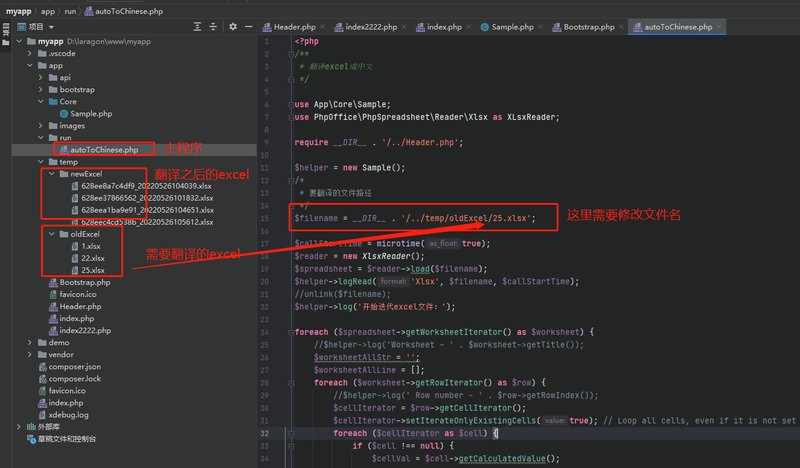
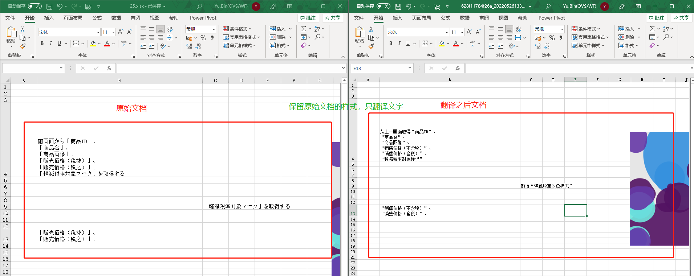

# tranlateExcel
##php本地小工具 翻译excel
主要功能：

1.利用百度翻译api+phppffice库 自动翻译成中文excel文档

2.可以翻译多个sheet

3.需要在本机搭建php开发环境，php > 7.3 , demo 示例用的是 PHP 7.4.29

4.代码完全开源，利用 phpoffice 可拓展翻译更多类型的文档，后期 可集成其他 翻译api接口，例如谷歌翻译等,欢迎pr

5.项目结构：

 
6.生成前后文档对比，保留原始文档格式

 
